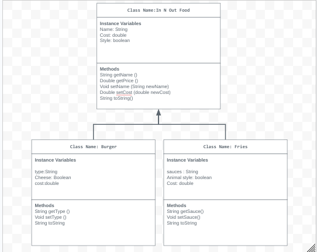

# Unit 2 - Store Management Project

## Introduction

You are opening a new business in your community! Businesses often need programs to manage the products and services they offer and track orders and requests from customers. Your goal is to create a store management system for your business.

## Requirements

Use your knowledge of object-oriented programming and class structure and design to create your store management system:
- **Create a class hierarchy** – Develop a superclass that represents a product or service your business offers and one or more subclasses that extend the superclass to represent more specific types of products or services.
- **Declare instance variables** – Declare instance variables in the superclass that are shared with the subclasses and instance variables in the subclasses that are not shared with the superclass.
- **Write constructors** – Write no-argument and parameterized constructors in the superclass and subclasses. Subclass constructors use the super keyword to call the superclass constructor.
- **Implement accessor and mutator methods** – Write accessor and mutator methods for instance variables that should be accessible and/or modifiable from outside of the class.
- **Implement a toString() method** – Write toString() methods in the superclass and subclasses that return information about the state of an object.

## UML Diagram

Put and image of your UML Diagram here. Upload the image of your UML Diagram to your repository, then use the Markdown syntax to insert your image here.

## Description
My project is about a burger shop, specifically In N out. My In n out store had two different sub classes, one for burgers and one for fries. I chose this topic because I love eating at in n out and really enjoy all their food items. In my project I used no-argument constructors, parameterized constructors, instance variables, accessor and mutator methods, and toString methods. Some instance variables I used had to do with the type of burger/fries, name, sauce, or cost. My parameterized constructors sets type to the specified type, cost to the specified cost, sauce to the given sauce (ketchup or spread) and name to the specific name. My no argument constructors give the cost and name for the burger, as well as the type of sauce. The mutator methods are set type and can return values like getType.